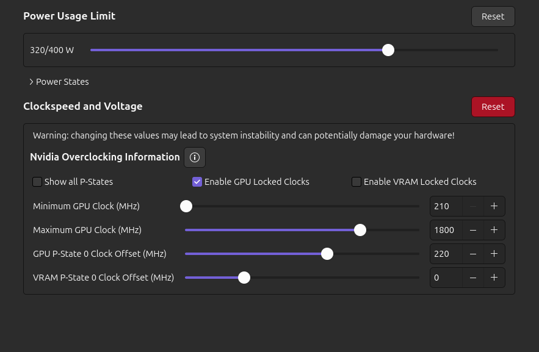

<div align="center">
  <picture>
    <source media="(prefers-color-scheme: dark)" srcset="assets/img/dotfiles_logo.png">
    <source media="(prefers-color-scheme: light)" srcset="assets/img/dotfiles_logo.png">
    
  </picture>
</div>

<h3 align="center">
  Ubuntu Development Setup for daily use.
  <br/>
</h3>

---

## Features

- **OS**: Ubuntu 25.10
- **Shell**: zsh + starship prompt
- **Editors**: Zed / VS Code + extensions
- **DE**: Gnome 49
- **Terminal**: Ptyxis
- **Theme**: Yaru dark purple
- **Optional**: SNAPS FREE!

#### ***Note:***
*I’m aware I’m on a non-LTS Ubuntu release right now.
Once 26.04 LTS drops and proves to be stable, I’ll update the dotfiles to match.
I went with Ubuntu for its balance of stability, simplicity, and great gaming support on the same machine.*

---

## First Steps After Installation

#### 1. Update the system and reboot

```bash
sudo apt update && sudo apt upgrade && sudo reboot now
```

#### 2. Curl install

```bash
sudo apt install curl
```

#### 3. Brave browser install and setting up

```bash
curl -fsS https://dl.brave.com/install.sh | sh
```

###### *Note: Now config the browser as default, sync key, etc*

---

## Optional: Clean snaps and disable it

#### Optional. Create a timeshift backup

#### 1. Remove base packages from snap and apt

```bash
sudo snap remove --purge firefox && sudo apt remove *firefox* -y && sudo apt remove *libreoffice* -y && sudo apt remove *remmina* -y && sudo apt remove *transmission* -y && sudo snap remove --purge thunderbird && sudo apt remove *thunderbird* -y
```

#### 2. Remove all extra packages:

```bash
sudo snap remove gtk-common-themes && sudo snap remove gnome-42-2204 && sudo snap remove snapd-desktop-integration && sudo snap remove desktop-security-center && sudo snap remove prompting-client && sudo snap remove snap-store && sudo snap remove firmware-updater && sudo snap remove bare && sudo snap remove core22 && sudo snap remove snapd
```

#### 3. Check list and remove if still have packages:

```bash
sudo snap list
```

#### 4. Disable Snaps:

```bash
sudo systemctl stop snapd && sudo systemctl disable snapd && sudo systemctl mask snapd && sudo apt purge snapd -y && sudo apt-mark hold snapd && sudo rm -rf ~/snap && sudo rm -rf /snap && sudo rm -rf /var/snap && sudo rm -rf /var/lib/snapd
```
```bash
sudo nano /etc/apt/preferences.d/nosnap.pref
```
```bash
Package: snapd
Pin: release a=*
Pin-Priority: -10
```

#### 5. Enable Firefox repositories:

```bash
sudo apt update && sudo install -d -m 0755 /etc/apt/keyrings
```
```bash
wget -q https://packages.mozilla.org/apt/repo-signing-key.gpg -O- | sudo tee /etc/apt/keyrings/packages.mozilla.org.asc > /dev/null
```
```bash
echo "deb [signed-by=/etc/apt/keyrings/packages.mozilla.org.asc] https://packages.mozilla.org/apt mozilla main" | sudo tee -a /etc/apt/sources.list.d/mozilla.list > /dev/null
```
```bash
echo '
Package: *
Pin: origin packages.mozilla.org
Pin-Priority: 1000
' | sudo tee /etc/apt/preferences.d/mozilla
```
```bash
sudo add-apt-repository ppa:mozillateam/ppa && sudo gnome-text-editor /etc/apt/preferences.d/mozillateamppa
```
```bash
Package: thunderbird*
Pin: release o=LP-PPA-mozillateam
Pin-Priority: 1000

Package: thunderbird*
Pin: release o=Ubuntu
Pin-Priority: -10
```
```bash
echo 'Unattended-Upgrade::Allowed-Origins:: "LP-PPA-mozillateam:${distro_codename}";' | sudo tee /etc/apt/apt.conf.d/51unattended-upgrades-thunderbird
```

#### 6. Enable flatpak and flathub:
```bash
sudo apt install --install-suggests gnome-software -y
```

- Reboot and run:

```bash
flatpak remote-add --if-not-exists flathub https://dl.flathub.org/repo/flathub.flatpakrepo
```

###### *Note: this steps are extracted from this links https://kskroyal.com/remove-snap-packages-from-ubuntu/ & https://ubuntuhandbook.org/index.php/2024/03/install-thunderbird-deb-ubuntu-2404/*

---

## Base System Setup & GNOME

#### 1. Install nvidia drivers with Additional Drivers
- Install your drivers with the tool provided by canonical. My drivers actually are 590 from nvidia. You can do it with a command:

```bash
sudo ubuntu-drivers autoinstall
```

- Reboot and enjoy your drivers

#### 2. Config Gnome Settings
- Set up your monitor(s) or multi-monitor layout as needed (via Settings → Displays).
- Disable mouse acceleration for precise control (especially useful for gaming/productivity)
- Tweak other settings

#### 3. Install my apps

```bash
sudo apt install gdebi dconf-editor gnome-tweaks pavucontrol steam vlc ratbagd ufw gufw
```
```bash
sudo systemctl enable --now ratbagd
```

- Install Discord ***.deb*** from their official website using GDEBI https://discord.com/.

- Install LACT ***.deb*** with GDEBI from their releases: https://github.com/ilya-zlobintsev/LACT/releases. After install enable it:
```bash
sudo systemctl enable --now lactd
```

- Now I configure TLP (or auto-cpufreq/lact) with my preferred options. This section can vary depending on your hardware and system. I adapt it to my NVIDIA RTX 3080 setup for optimal power management and performance.

<div align="center">
  <picture>
    <source srcset="assets/img/undervolt.png">
    
  </picture>
</div>

- Open gnome software and install manually:

```bash
- Refine
- Gnome Extensions Manager
- Bitwarden
- ProtonPlus
- Protontricks
- AdwSteamGtk
- Zen Browser (My new replace for brave)
- Spotify
- Obsidian
- Piper
- qBittorrent
- Flatseal
```

- Finally open refine and enable VRR in shell settings.

#### 4. Firewall & Tweaks
```bash
sudo systemctl enable ufw && sudo systemctl start ufw && sudo ufw deny 22/tcp
```
```bash
sudo apt install ubuntu-restricted-extras build-essential checkinstall libfuse2t64 unzip p7zip p7zip-full unrar make curl ca-certificates libssl-dev libxmlsec1-dev libmagic-dev libmagickwand-dev zsh fzf git-lfs starship bleachbit ffmpeg
```
```bash
sudo mkdir -p '/etc/systemd/resolved.conf.d' && sudo -e '/etc/systemd/resolved.conf.d/99-dns-over-tls.conf'
```
```
[Resolve]
DNS=1.1.1.2#security.cloudflare-dns.com 1.0.0.2#security.cloudflare-dns.com 2606:4700:4700::1112#security.cloudflare-dns.com 2606:4700:4700::1002#security.cloudflare-dns.com
DNSOverTLS=yes
Domains=~.
```
```bash
sudo timedatectl set-local-rtc '0'
```
```bash
gsettings set org.gnome.shell.extensions.dash-to-dock click-action 'minimize-or-previews'
```

#### 5. Optional. Setup my headphones JBL dual channel.
###### I have JBL Quantum 810 Wireless headphones that support two separate audio channels: one for system audio and another for voice chats. By default, they are not configured this way.

- Open pavucontrol, find soundcard headphones option and change its profile to Pro Audio. Now got the dual channel enabled, only need rename it.

```bash
pw-cli ls Node | less
```

- Copy alsa node name for System channel and the Chat

```bash
mkdir -p ~/.config/wireplumber/wireplumber.conf.d
```
```bash
nano ~/.config/wireplumber/wireplumber.conf.d/55-audio-rename.conf
```

- Paste this config into the nano editor:
```json
monitor.alsa.rules = [
  {
    matches = [
      {
        node.name = "alsa_output.usb-Harman_International_Inc_JBL_Quantum810_Wireless-00.pro-output-0"
      }
    ]
    actions = {
      update-props = {
        node.description = "JBL Quantum 810 Wireless Game"
      }
    }
  }
  {
    matches = [
      {
        node.name = "alsa_output.usb-Harman_International_Inc_JBL_Quantum810_Wireless-00.pro-output-1"
      }
    ]
    actions = {
      update-props = {
        node.description = "JBL Quantum 810 Wireless Chat"
      }
    }
  }
]
```

```bash
systemctl --user restart wireplumber.service
```


---


## Contributing

placeholder
